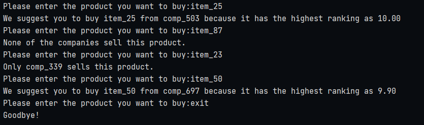

# .txt Manipulation

## About the Project

Project, gets a product name input from the user. The company with the highest rating 
within the companies selling this product is given to the user.If there is no company 
selling the product or only one company this is also stated.
  

The two txt files given as:

* [Companies and products (products.txt)](products.txt) 
* [Companies and ratings (ratings.txt)](ratings.txt)

are manipulating to the desired format. Data is kept in the dictionary data structure as 
it will be more efficient in terms of performance for this project.

## Test

